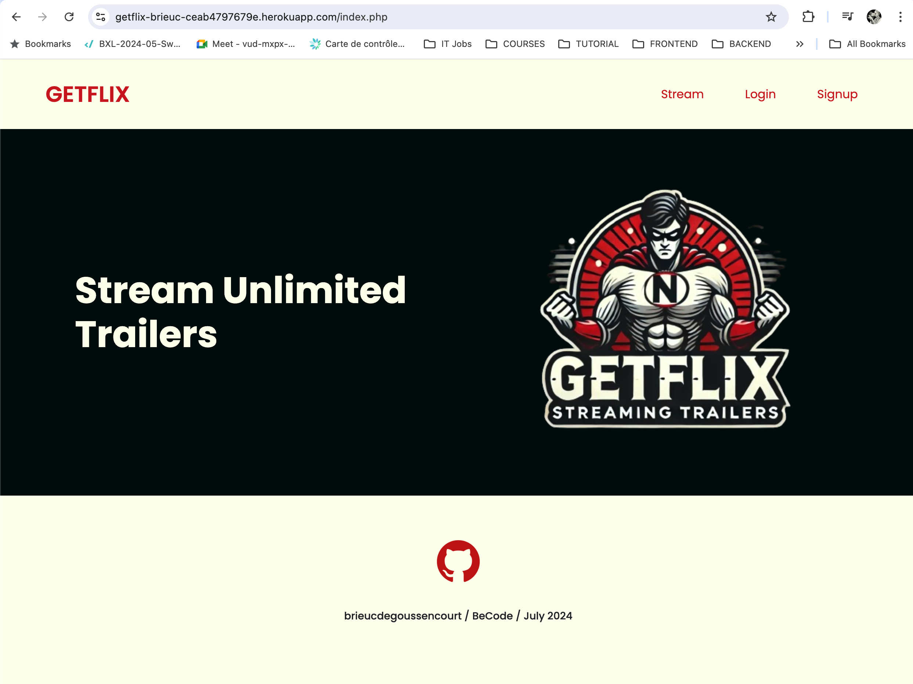
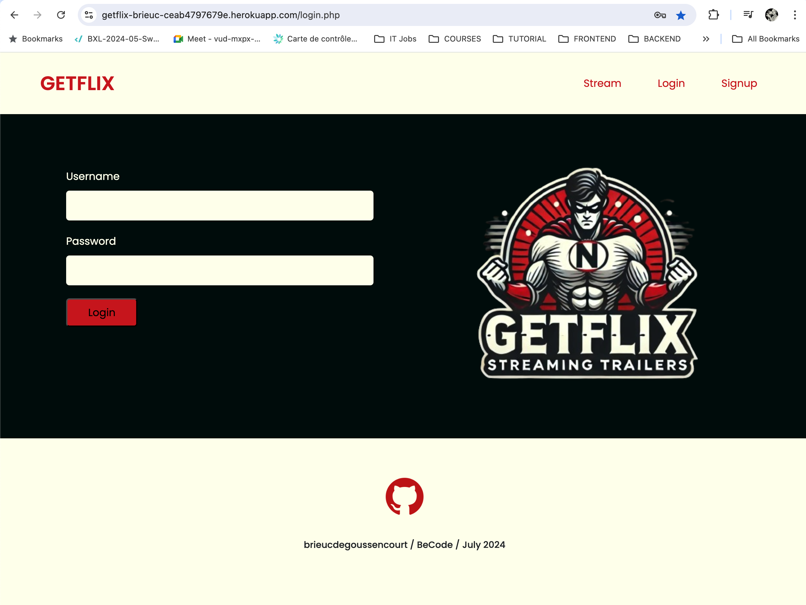
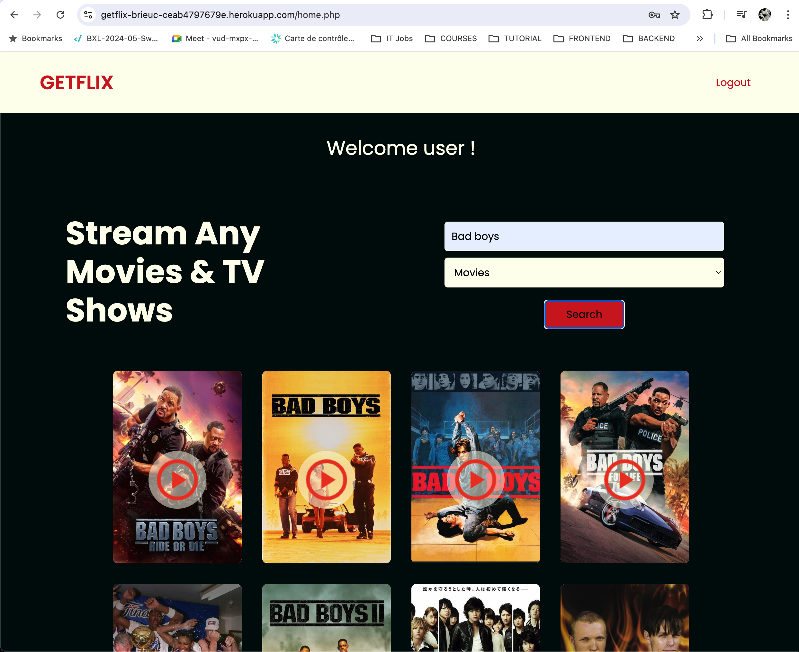
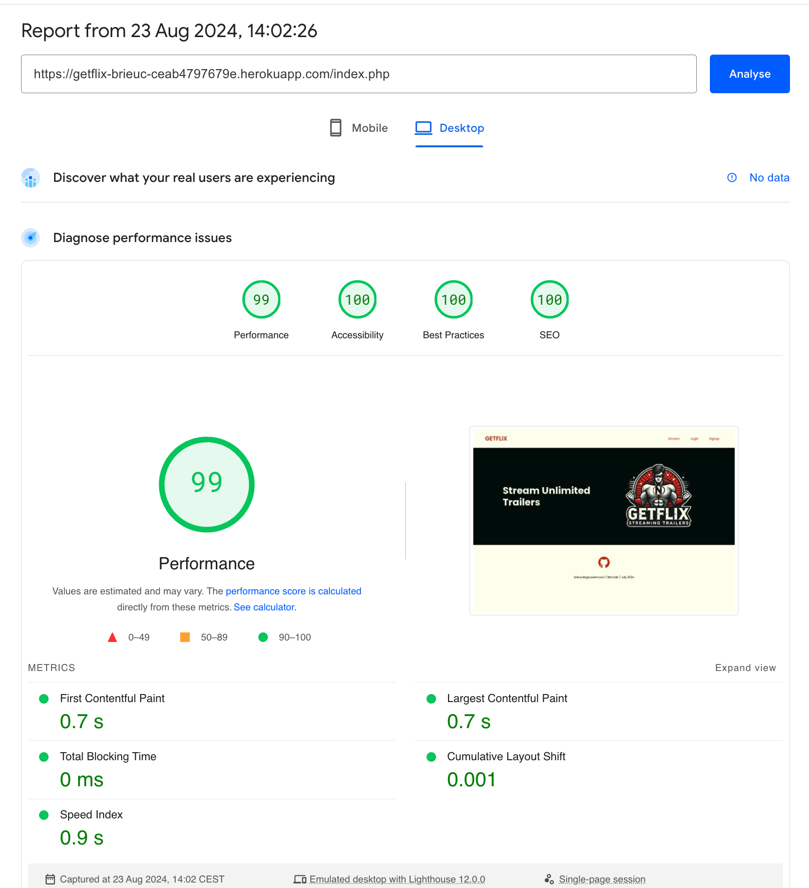
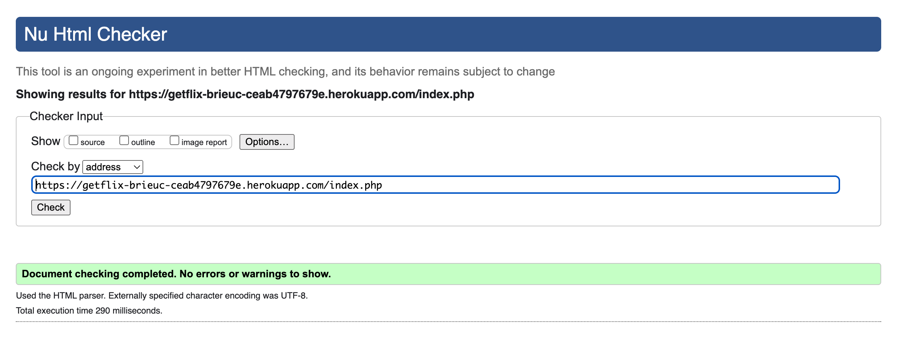

# [GetfLix Project](https://getflix-brieuc-ceab4797679e.herokuapp.com/index.php)

Welcome to Getflix, a streaming website dedicated to showcasing  movie & tv trailers. 

This project leverages a combination of front-end and back-end technologies to deliver a seamless user experience.

This is a consolidation project made solo @ [Becode](https://becode.org/fr/) in July & August 2024. 

Here are the full [guidelines](/guidelines.md).

## Technologies used

### Backend

- TMBD API

Fetching data from the  [TMDB API](https://developer.themoviedb.org/reference/intro/getting-started) to display items infos and locate youtube trailers.

- Heroku, GIT & PostgreSql

The project is deployed and hosted on Heroku, utilizing the PostgreSQL add-on for database management. It is linked to my github repository for coninuous deployment.

- PHP

For server-side scripting and handling user authentication.

- Composer

Used to manage PHP dependencies, facilitating deployment on Heroku.

### Frontend

- HTML/CSS/JS

For structuring, styling, and adding interactivity to the website. JS also handles asynchronous requests.

- Bootstrap

A responsive framework to ensure that the site looks great on all devices.

- AI

The logo is made tks to chatGPT image generator.

## Main files

- `connection.php`

This file manages the database connection, utilizing PHP’s PDO extension to interact with the PostgreSQL database. It ensures secure and efficient database operations throughout the project.

- `home.php`

The home page of the Getflix project, where users can view available trailers. It serves as the main landing page after successful login.

- `login.php`

Handles the login functionality, including user authentication. It checks the credentials against the PostgreSQL database and initiates a user session upon successful login.

## How to Run the Project

	
1. Click [here](https://getflix-brieuc-ceab4797679e.herokuapp.com/index.php)
2. Sign up
2. Start streaming!

## Room for improvement

- secure the code by removing hardcoded keys
- eliminate render-blocking resources for best performance
- embed youtube videos
- add registrants the right to comment on the content
- backoffice to store and manage comments
- Management of lost passwords
- Create a page or section that displays the top movies with the movie db API.
- Integrate a newsletter with Mailchimp.

## PageSpeed Insights

## The W3C Markup Validation Service

## What I've learned.

One should not underestimate PHP deployment on Heroku. Migrating from the local environment to the remote one got me a few more white hairs on my head. I know understand better the concept of SQL database & environment variable.

## License

This project is open-source and available under the MIT License.

It uses TMDB and the TMDB APIs but is not endorsed, certified, or otherwise approved by TMDB.

## AUTHOR

**Brieuc Degoussencourt** - [GitHub](https://github.com/brieucdegoussencourt)
